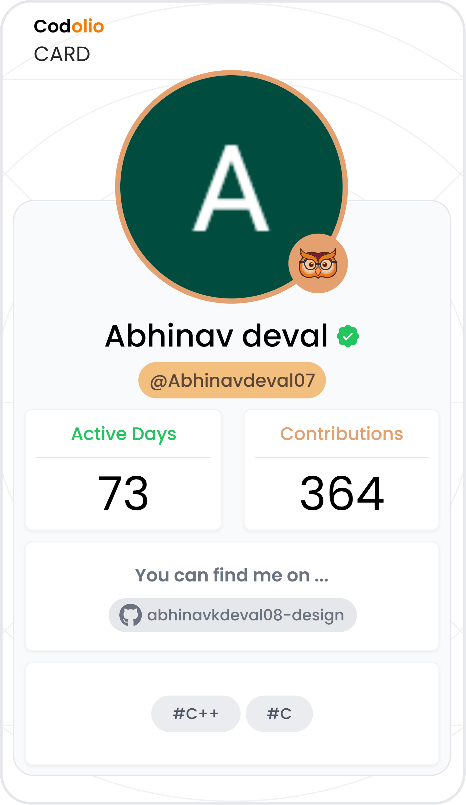

# 🚀 DSA Solutions Vault | Abhinav Deval

<div align="center">

[](https://leetcode.com/u/abhinav_deval07/)
[](https://codeforces.com/profile/abhinavkdeval29)
[](https://codolio.com/profile/Abhinavdeval07)
[](https://codolio.com/profile/Abhinavdeval07)
[](https://isocpp.org/)
[](http://iiitkalyani.ac.in/)

*Solving one problem at a time, building algorithms that scale.*

[LeetCode](https://leetcode.com/u/abhinav_deval07/) • [Codeforces](https://codeforces.com/profile/abhinavkdeval29) • [Codolio](https://codolio.com/profile/Abhinavdeval07) • [LinkedIn](https://www.linkedin.com/in/abhinav-deval-549b6438b/)

</div>

---

## 📖 Overview

Welcome to my **DSA Solutions Vault**! This repository is a curated collection of my solutions to various algorithmic challenges. While I actively participate in Codeforces contests, **LeetCode** and core CP platforms are where I focus on mastering complex data structures, algorithmic patterns, and low-latency system bounds.

> *"Consistency is the only shortcut to success."* 🔁

---

## 📊 Platform Analytics

<div align="center">
  
</div>

<br/>

### 💻 LeetCode Live Card

<div align="center">
  
</div>

<br/>

### 📈 Progress Summary (via [Codolio](https://codolio.com/profile/Abhinavdeval07))

| Metric | Value |
|---|---|
| 🧩 Total Questions Solved | **328** |
| 📅 Active Days | **155** |
| 🔥 Max Streak | **91 Days** |
| 🔥 Current Streak | **91 Days** |
| 📝 Total Submissions | **476** |
| 🏆 Contests Attended | **6** (LeetCode: 3 • Codeforces: 3) |
| ⭐ Latest Contest Rating | **1500** (Biweekly Contest 190) |
| 🌍 Codeforces Max Rating | **902** (Newbie) |

**DSA Difficulty Split:** 🟢 Easy `106` • 🟡 Medium `156` • 🔴 Hard `45` (Total: `307`)
**Competitive Programming:** `21` problems across Codeforces

- **LeetCode:** [@abhinav_deval07](https://leetcode.com/u/abhinav_deval07/)
- **Codeforces:** [@abhinavkdeval29](https://codeforces.com/profile/abhinavkdeval29) (Max Rating: 902)
- **Codolio:** [@Abhinavdeval07](https://codolio.com/profile/Abhinavdeval07) (328+ Total Solved | 91-Day Max & Current Streak)
- **Active Goal:** Cracking 100+ DP & Graph problems, pushing CF rank towards **Pupil**, and scaling Vibrodo's audio engine.

---

## 📂 Repository Structure

The vault is organized by platform for clean navigation and searchability:

```bash
.
├── 🏆 Codeforces/      # Problems categorized by Contest ID / Difficulty
├── 💻 LeetCode/        # Problems indexed by Problem Number and Topic
└── 🛠️ Templates/       # Fast I/O snippets and CP algorithm templates
```

## 🏆 Featured Codeforces Solutions

| # | Problem | Difficulty | Tags | Solution |
|---|---|---|---|---|
| 4A | Watermelon | 🟢 800 | Math / Logic | [View Code](#) |
| 71A | Way Too Long Words | 🟢 800 | Strings / Implementation | [View Code](#) |
| 231A | Team | 🟢 800 | Greedy / Counting | [View Code](#) |
| 546A | Soldier and Bananas | 🟢 800 | Math / Loops | [View Code](#) |
| 281A | Word Capitalization | 🟢 800 | Strings | [View Code](#) |

## 💻 Top LeetCode Picks

| # | Problem | Difficulty | Key Technique | Solution |
|---|---|---|---|---|
| 42 | Trapping Rain Water | 🔴 Hard | Two Pointers / Pre-computation | [View Code](#) |
| 239 | Sliding Window Maximum | 🔴 Hard | Monotonic Deque | [View Code](#) |
| 128 | Longest Consecutive Sequence | 🟡 Medium | HashSet / O(N) Bounds | [View Code](#) |
| 3 | Longest Substring Without Repeating Characters | 🟡 Medium | Sliding Window + Hash Map | [View Code](#) |
| 15 | 3Sum | 🟡 Medium | Two Pointers / Sorting | [View Code](#) |
| 49 | Group Anagrams | 🟡 Medium | Hash Map Categorization | [View Code](#) |
| 56 | Merge Intervals | 🟡 Medium | Interval Sorting / Greedy | [View Code](#) |

## 🛠️ Tech Stack & Tools

- **Language:** C++20 (G++ 13)
- **Environment:** VS Code, Linux CLI, Codeforces Web IDE
- **Core Strengths:** Arrays, Dynamic Programming, Sliding Window, Monotonic Stacks, Hash Tables, Trees & Graphs

## 🤝 Let's Connect!

If you're also passionate about competitive programming, low-latency architecture, or open-source systems, let's connect on [LinkedIn](https://www.linkedin.com/in/abhinav-deval-549b6438b/) or check out my [Codolio profile](https://codolio.com/profile/Abhinavdeval07).
