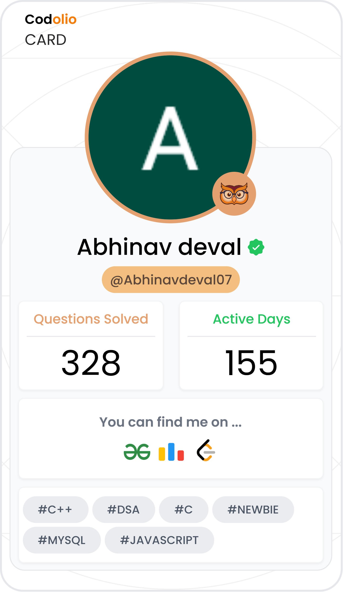

<div align="center">

# 🚀 DSA Solutions Vault
### Abhinav Deval

[;112+day+streak+%F0%9F%94%A5;Preparing+for+GSoC+2027+%F0%9F%8C%B1)](https://git.io/typing-svg)

<br/>

[](https://leetcode.com/u/abhinav_deval07/)
[](https://leetcode.com/u/abhinav_deval07/)
[-1E7D32?style=for-the-badge&logo=codeforces&logoColor=white)](https://codeforces.com/profile/abhinavkdeval29)
[](https://codolio.com/profile/Abhinavdeval07)
[](https://codolio.com/profile/Abhinavdeval07)
[](http://iiitkalyani.ac.in/)

<br/>

[](https://skillicons.dev)

<br/>

**[🔗 LeetCode](https://leetcode.com/u/abhinav_deval07/) &nbsp;•&nbsp; [🔗 Codeforces](https://codeforces.com/profile/abhinavkdeval29) &nbsp;•&nbsp; [🔗 Codolio](https://codolio.com/profile/Abhinavdeval07) &nbsp;•&nbsp; [🔗 LinkedIn](https://www.linkedin.com/in/abhinav-deval-549b6438b/)**

</div>

---

## 📖 Overview

Welcome to my **DSA Solutions Vault**! This repository is a curated collection of my solutions to various algorithmic challenges. While I actively participate in Codeforces contests, **LeetCode** and core CP platforms are where I focus on mastering complex data structures, algorithmic patterns, and low-latency system bounds.

> *"Consistency is the only shortcut to success."* 🔁

- 🎓 ECE @ IIIT Kalyani (Batch of 2029)
- 🏆 10 contests so far: LeetCode 4 • Codeforces 5 • AtCoder 1
- 🎯 Active goal: cracking **100+ DP & Graph** problems and pushing my Codeforces rank toward **Specialist**
- 🌱 Preparing to contribute to **GSoC 2027**

---

## 📊 Platform Analytics

<div align="center">
  <table>
    <tr>
      <td align="center" width="50%">
        
      </td>
      <td align="center" width="50%">
        
      </td>
    </tr>
  </table>
</div>

<br/>

### 📈 Progress Summary

<details open>
<summary><b>Combined (via <a href="https://codolio.com/profile/Abhinavdeval07">Codolio</a>)</b></summary>
<br/>

| Metric | Value |
|---|---|
| 🧩 Total Questions Solved (All Platforms) | **356** (DSA 326 • Codeforces 29 • GFG 1) |
| 🎚️ DSA by Difficulty (all platforms) | 🟢 115 Easy • 🟡 165 Medium • 🔴 46 Hard |
| 📅 Active Days (Combined) | **177** |
| 🔥 Max / Current Streak | **112 / 112 Days** |
| 📝 Total Submissions | **466** |
| 🏆 Contests Attended (Combined) | **10** (LeetCode 4 • Codeforces 5 • AtCoder 1) |
| ⭐ Codolio Rating | **1500** |
| 🌐 Global Rank (Codolio) | **10,169** |
| 🏅 Awards | **4** |

</details>

<details>
<summary><b>LeetCode Breakdown — <a href="https://leetcode.com/u/abhinav_deval07/">@abhinav_deval07</a></b></summary>
<br/>

| Metric | Value |
|---|---|
| ✅ Solved | **281 / 4069** (🟢 106 Easy • 🟡 143 Medium • 🔴 32 Hard) |
| 🎯 Acceptance Rate | **82.09%** |
| ⭐ Contest Rating | **1590** |
| 🏆 Contests Attended | **4** |
| 📅 Active Days | **134** |
| 🔥 Max Streak | **112 Days** |
| 🌐 Rank | **562,554** |
| 🏅 Badges | **4** (latest: 100 Days Badge 2026) |

</details>

<details>
<summary><b>Codeforces Breakdown — <a href="https://codeforces.com/profile/abhinavkdeval29">@abhinavkdeval29</a></b></summary>
<br/>

| Metric | Value |
|---|---|
| 🌍 Current / Max Rating | **1274 (Pupil)** |
| 🧩 Problems Solved | **29** |
| 🏆 Contests Attended | **5** |

</details>

<br/>

### 🧠 Skills Breakdown (LeetCode)

| Level | Top Tags |
|---|---|
| 🔴 Advanced | Dynamic Programming `x36` • Game Theory `x10` • Divide and Conquer `x9` |
| 🟡 Intermediate | Math `x79` • Hash Table `x62` • Greedy `x32` |
| 🟢 Fundamental | Array `x174` • String `x63` • Sorting `x46` |

### 💻 Languages Used

`C++` — 272 problems • `JavaScript` — 5 problems • `C` — 3 problems

---

## 📂 Repository Structure

```bash
.
├── 🏆 Codeforces/      # Problems categorized by Contest ID / Difficulty
├── 💻 LeetCode/        # Problems indexed by Problem Number and Topic
└── 🛠️ Templates/       # Fast I/O snippets and CP algorithm templates
```

## 🏆 Featured Codeforces Solutions

| # | Problem | Difficulty | Tags | Solution |
|---|---|---|---|---|
| 4A | Watermelon | 🟢 800 | Math / Logic | [View Code](#) |
| 71A | Way Too Long Words | 🟢 800 | Strings / Implementation | [View Code](#) |
| 231A | Team | 🟢 800 | Greedy / Counting | [View Code](#) |
| 546A | Soldier and Bananas | 🟢 800 | Math / Loops | [View Code](#) |
| 281A | Word Capitalization | 🟢 800 | Strings | [View Code](#) |

## 💻 Top LeetCode Picks

| # | Problem | Difficulty | Key Technique | Solution |
|---|---|---|---|---|
| 42 | Trapping Rain Water | 🔴 Hard | Two Pointers / Pre-computation | [View Code](#) |
| 239 | Sliding Window Maximum | 🔴 Hard | Monotonic Deque | [View Code](#) |
| 128 | Longest Consecutive Sequence | 🟡 Medium | HashSet / O(N) Bounds | [View Code](#) |
| 3 | Longest Substring Without Repeating Characters | 🟡 Medium | Sliding Window + Hash Map | [View Code](#) |
| 15 | 3Sum | 🟡 Medium | Two Pointers / Sorting | [View Code](#) |
| 49 | Group Anagrams | 🟡 Medium | Hash Map Categorization | [View Code](#) |
| 56 | Merge Intervals | 🟡 Medium | Interval Sorting / Greedy | [View Code](#) |

<details>
<summary>🕐 <b>Recently Solved (LeetCode)</b> — click to expand</summary>
<br/>

- Koko Eating Bananas
- Find Peak Element
- Valid Parentheses
- Find First and Last Position of Element in Sorted Array
- Search in Rotated Sorted Array
- Binary Search
- Maximum Nesting Depth of the Parentheses
- Longest Subarray Divisible by K with At Most One Negation I
- Transform Array Using Pair Operations
- Minimum Queen Moves to Reach Target

</details>

## 🛠️ Tech Stack & Tools

- **Language:** C++20 (G++ 13)
- **Environment:** VS Code, Linux CLI, Codeforces Web IDE
- **Core Strengths:** Arrays, Dynamic Programming, Sliding Window, Monotonic Stacks, Hash Tables, Trees & Graphs

---

## 🤝 Let's Connect!

If you're also passionate about competitive programming, low-latency architecture, or open-source systems, let's connect on [LinkedIn](https://www.linkedin.com/in/abhinav-deval-549b6438b/) or check out my [Codolio profile](https://codolio.com/profile/Abhinavdeval07).
